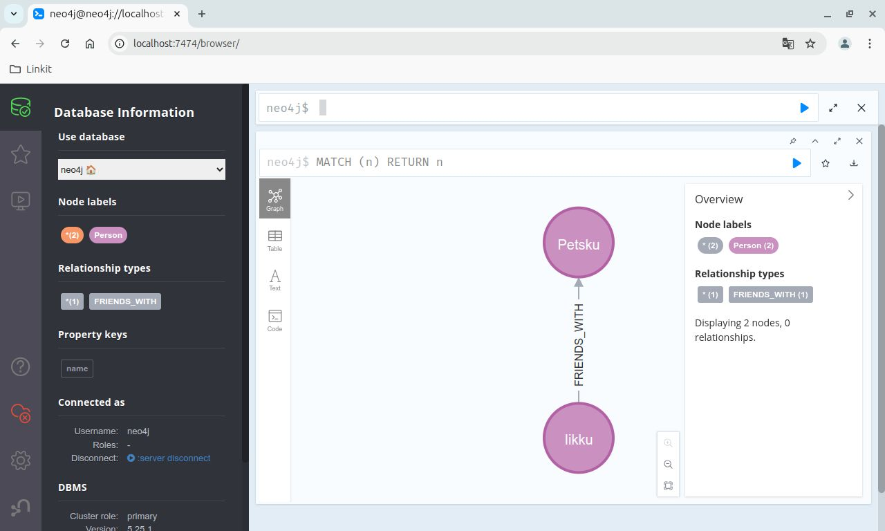

# GraphQL Books API with Neo4j

This API allows you to manage a collection of books and authors, facilitating complex queries about their relationships. This project is a simple GraphQL API for managing a books database, powered by a Node.js backend and integrated with Neo4j as the primary database. Using GraphQL allows clients to request specific data about books and their authors in a single API call. Neo4j, a graph database, is well-suited for handling relational data structures, making it easy to query complex relationships.

## Project Structure

- `/graphql-books-api`: Root folder containing the source code.
- `relationships.py`: Script to create nodes and relationships in Neo4j for initial data.
- `Dockerfile`: Configuration for running Neo4j in a Docker container.
- `index.js`: Main server file, handles GraphQL requests and connects to Neo4j.

## Features

- **GraphQL API**: Provides a flexible way to query and mutate book and author data.
- **Neo4j Integration**: Manages book and author data using Neo4j’s graph database.
- **Express Server**: Serves the GraphQL endpoint for API requests.
- **Self-documenting API**: The GraphQL schema makes the API self-documenting.

## Installation

### Prerequisites

- **Node.js**: Install Node.js (version 14 or higher). You can download it [here](https://nodejs.org/).
- **Python 3.12**: Ensure Python is installed. You can download it [here](https://www.python.org/downloads/).
- **Docker**: Required to run Neo4j in a container. Get Docker from [here](https://docs.docker.com/get-docker/).
- **Neo4j Database**: Version 4.3 or higher is recommended for compatibility with the GraphQL API. This can be run via Docker as shown in the setup instructions.
- **Neo4j Python Driver**: Install via:

  ```bash
  pip install neo4j
  ```
### Additional Notes

If Neo4j features or APIs specific to certain versions are critical for your project, you could add a note explaining why that particular version or higher is needed. For example:

> **Note**: Neo4j version 4.3 or higher is required due to its support for [specific features, e.g., schema constraints or updated Cypher syntax], which are essential for this project.

### 1. Clone the Repository

```bash
git clone https://github.com/yourusername/graphql-books-api.git
cd graphql-books-api
```
### 2. Install Node.js Dependencies

```bash
npm install
```
### 3. Configure Neo4j Connection

Open `index.js` (main server file) and add your Neo4j database connection details.

```bash
const neo4j = require('neo4j-driver');
// Configure connection to Neo4j database
const driver = neo4j.driver(
  'bolt://localhost:7687', 
  neo4j.auth.basic('neo4j', 'your_password')
);
```
**Note**: For security, avoid committing your Neo4j credentials to version control.

### 4. Set Up and Run Neo4j

Pull and run Neo4j Docker container:

```bash
docker pull neo4j
docker run \
   --name neo4j \
   -p 7474:7474 \
   -p 7687:7687 \
   -d \
   -e NEO4J_AUTH=neo4j/<your_secure_password> \
   neo4j
```
Here's a breakdown of what each part of this command does:

- `docker pull neo4j`: Downloads the latest Neo4j image from Docker Hub.
- `docker run`: Starts a new Docker container with the specified settings.
- `--name neo4j`: Assigns the name neo4j to this container instance, making it easier to reference in future Docker commands.
- `-p 7474:7474`: Maps port 7474 on the container to port 7474 on your local machine. This is the port where Neo4j’s web interface (Neo4j Browser) will be accessible at http://localhost:7474.
- `-p 7687:7687`: Maps port 7687 on the container to port 7687 on your local machine. This port is used by the Bolt protocol, which allows the API to communicate with Neo4j.
- `-d`: Runs the container in detached mode (in the background), so your terminal remains free for other commands.
- `-e NEO4J_AUTH=neo4j/password`: Sets the default username and password for Neo4j. Replace `password` with a secure password of your choice.

Once the container is running, you can access Neo4j’s browser interface at http://localhost:7474 and log in with the credentials you set.

Access the Neo4j browser at `http://localhost:7474` and log in with:
- **Username**: neo4j
- **Password**: *your_password* (replace with the password you set above)

# Running the API

Run the server with `node index.js`.

1. Start the Neo4j Database:

Ensure your Neo4j instance is running. By default, it should be accessible at `bolt://localhost:7687`.

2. Start the GraphQL API Server:

```bash
node index.js
```

3. Access the API:

Visit `http://localhost:4000/graphql` in your browser to open the GraphiQL interface for testing queries.

# Example Queries

- Fetch all books and their authors:

```graphql
{
  books {
    title
    author {
      name
    }
  }
}
```
- Fetch all authors and their books:

```graphql
{
  authors {
    name
    books {
      title
    }
  }
}
```

# Usage

## Running the `relationships.py` Script

This script creates sample nodes and relationships in the Neo4j database, allowing you to test the GraphQL API with initial data.

```bash
python relationships.py
```
**Note**: If you receive any warnings about `write_transaction` or `read_transaction`, these refer to methods that were renamed to `execute_write` and `execute_read` in recent Neo4j Python driver versions.

## Interacting with Neo4j

To visualize or interact with the data, use the Neo4j browser at `http://localhost:7474`. You can execute Cypher queries to view or modify data. For example:

```cypher
MATCH (p:Person)-[:FRIENDS_WITH]->(f)
RETURN p.name, f.name
```

# Cypher Query Examples

Here are some example Cypher queries used in this project:

1. **Creating a Person Node**

```cypher
CREATE (p:Person {name: 'Alice', age: 30})
```
2. **Creating a Person Relationship**

```cypher
MATCH (a:Person {name: 'Alice'}), (b:Person {name: 'Bob'})
CREATE (a)-[:FRIENDS_WITH]->(b)
```
3. **Deleting a Node and its Relationships**

```cypher
MATCH (n:Person {name: 'Alice'})
DETACH DELETE n
```

# Project Aims

This project demonstrates how to:

- Establish a GraphQL API integrated with Neo4j.
- Use Cypher to query and manage data relationships.
- Utilize Neo4j with Python for data visualization and interactions.

# Screenshots

<div style="text-align: center;"><em>Figure 1: API Response Example</em></div>
